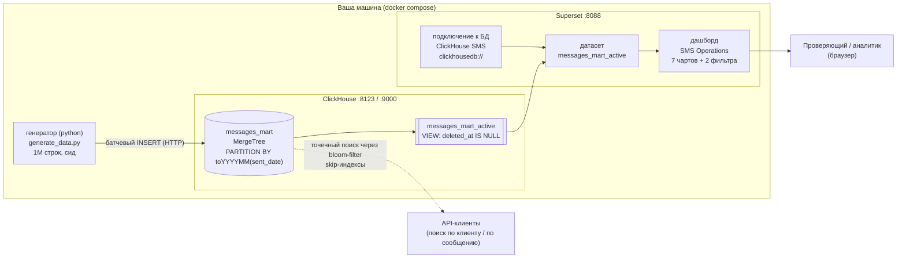
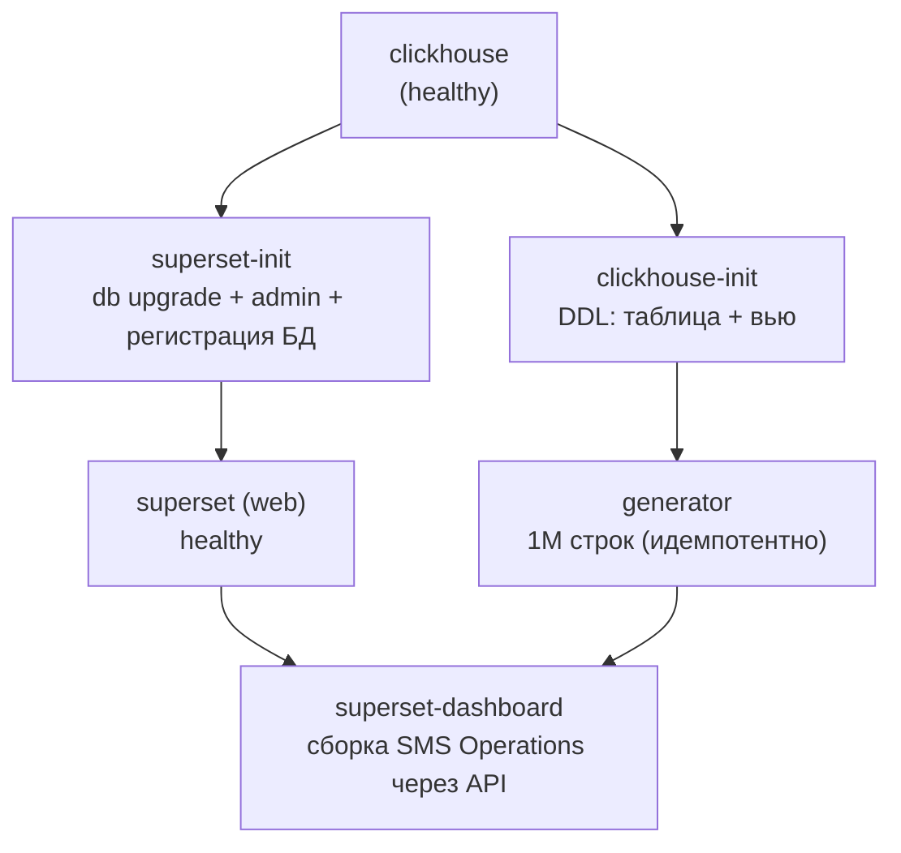

# Архитектура

Если открываете диаграмму через VS Code, установите расширение:
`mermaidchart.vscode-mermaid-chart`

## Стек и поток данных

## Оркестрация одноразовых джоб (что запускает `docker compose up -d`)

## Почему именно эти компоненты
- **ClickHouse** — колоночная OLAP-СУБД, идеальна для `count()`/`sum()` по витрине событий на 1М строк.
- **Вью `messages_mart_active`** — единая «точка отсечения», исключающая soft-delete строки, так что
  каждый чарт дашборда корректен по построению.
- **Superset** — подключается по `clickhousedb://` (драйвер clickhouse-connect); дашборд + чарты +
  2 глобальных native-фильтра; объекты выгружены в YAML для git.
- **Два потребителя** — ключ сортировки обслуживает Superset (срезы по клиенту + диапазону времени),
  а bloom-filter skip-индексы обслуживают точечный поиск API (message_id, application_uuid).
